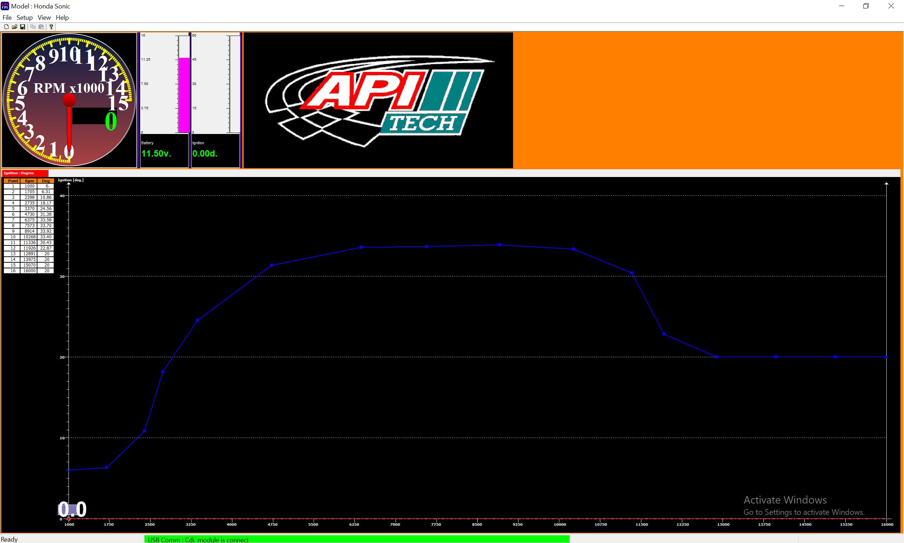

# Communicate with API Tech Sonic CDI over RS232 serial bus

A simple python script to present capability of reading data from API Tech CDI (RPMs, ignition timing, battery voltage) as well as read and write ignition map.

- `cdi_monitor.py` - display details about running CDI (RPMs, ignition timing, battery voltage)
- `cdi_ignition_map.py` - basic example of reading/writing ignition map from/to CDI unit (work in progress)

# Run the script

## 📋 Requirements

- Python 3.6 or higher
- pyserial library

## 🏗️ Installation

Install Python dependencies:
```bash
pip install -r requirements.txt
```


## 🚀 Execution

```bash
python cdi_monitor.py <port-name>
```

Where `port-name` is:

- in Windows: usually COM0 to COM40
  - Check available devices with a Device Manager program
- MacOS: in my case it is /dev/tty.usbserial-1420
  - List available devices with `ls /dev/` command


# 🔌 Communication details

## Serial Configuration

- **Data Format:** 8N1 (8 data bits, no parity, 1 stop bit)
- **Baud Rates:** 9600, 19200, 38400, 57600, or 115200
- **Flow Control:** None

## Initialization Sequence

The CDI module expects a 4-byte handshake:
1. `0x01` - Wake-up/initialization byte
1. `0xAB` - Handshake byte
1. `0xAC` - Status request
1. `0xA1` - Ready command


## Packet Format (22 bytes)

```
Byte 0:      0x03        - Packet header/type identifier
Bytes 1-2:   RPM         - Engine RPM (16-bit big-endian)
Bytes 3-4:   0x00 0x00   - Reserved/unused
Bytes 5-6:   0x00 0x00   - Reserved/unused  
Byte 7:      Battery     - Battery voltage in decivolts (11.5V = 115 = 0x73)
Byte 8-9:    Status      - Can be an ignition timing
Bytes 10-19: Various     - Additional status/config data
Byte 20:     Checksum    - Packet checksum
Byte 21:     0xA9        - End marker
```

## Decoding examples

## 1. Battery Voltage (Byte 7) 
- **Format:** Single byte in decivolts (1/10 volt)
- **Examples:**
  - `0x73` = 115 = 11.5V
  - `0x74` = 116 = 11.6V
  - `0x7E` = 126 = 12.6V
  - `0x82` = 130 = 13.0V

## 2. Engine RPM (Bytes 1-2) 
- **Format:** 16-bit unsigned integer, BIG-ENDIAN
- **Examples:**
  - `0x00 0x00` = 0 RPM (engine off)
  - `0x02 0x80` = 640 RPM (idle/kickstart)
  - `0x0B 0x40` = 2880 RPM
  - `0x05 0xC0` = 1472 RPM
  - `0x04 0xC0` = 1216 RPM

## Test Case 1: Engine Off
- **Packet:** `03 00 00 00 00 00 00 74 10 04 00 08 00 0A 02 01 03 02 02 01 A8 A9`
- **Decoded:**
  - Battery: 11.6V 
  - RPM: 0 

## Test Case 2: 2880 RPM
- **Packet:** `03 0B 40 00 00 00 00 7E 08 59 00 08 00 1D 02 01 03 02 02 01 5D A9`
- **Decoded:**
  - Battery: 12.6V 
  - RPM: 2880 

## Test Case 3: 1216 RPM
- **Packet:** `03 04 C0 00 00 00 00 76 0D A2 00 08 00 10 02 01 03 02 02 01 0F A9`
- **Decoded:**
  - Battery: 11.8V 
  - RPM: 1216 

# What's missing

- Ignition timing display at given RPMs at given time

# 👷 How the script was built?

The script is based on reverse engineering of a COM port sniffing during communication of an official API Tech tuner product with CDI device.



The `ignition map from tuner program.cfg` file consists of an ignition map configuration visible on the screenshot above.

You can download the Tuner program visible on the screenshot above from [official API tech download page](https://apitechth.com/download-program/). Look for 'OLD CDI and NEW CDi' package.

## Disclosure

The program was written with a significant help of Claude Opus 4. AI did:

- hex bytes decoding
- most of Python script writing